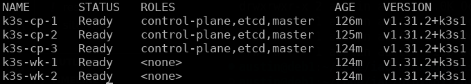

# k3s ha cluster with ansible

ansible playbook for deploying k3s in ha

## overview

this deploys a k3s cluster with:

- 3 control plane nodes (embedded etcd)
- 2 worker nodes
- kube-vip for control plane ha (virtual IP)
- metallb for loadBalancer services
- **secrets encryption at rest** (AES-CBC)
- **auto-generated secure tokens** (not committed to git)

## architecture

```
┌─────────────────────────────────────────────────────────────┐
│                     Virtual IP: 192.168.1.<IP>              │
│                   (kube-vip managed)                        │
└───────────────────────┬─────────────────────────────────────┘
                        │
        ┌───────────────┼───────────────┐
        │               │               │
┌───────▼──────┐ ┌──────▼──────┐ ┌─────▼───────┐
│  k3s-cp-1    │ │  k3s-cp-2   │ │  k3s-cp-3   │
│ 192.168.1.<> │ │ 192.168.1.<>│ │ 192.168.1.<>│
│ (etcd)       │ │ (etcd)      │ │ (etcd)      │
└──────────────┘ └─────────────┘ └─────────────┘
        Control Plane Nodes (Masters)

        ┌──────────────┐ ┌─────────────┐
        │  k3s-wk-1    │ │  k3s-wk-2   │
        │ 192.168.1.<> │ │ 192.168.1.< |
        └──────────────┘ └─────────────┘
             Worker Nodes

┌────────────────────────────────────────────────────────┐
│  MetalLB IP Pool: 192.168.1.<> - 192.168.1.<>          │
└────────────────────────────────────────────────────────┘
```

## prerequisites

### system requirements

Control Machine:
- ansible 2.11+
- python 3.8+
- SSH key access to all nodes

target nodes:
- 5 VMs running debian 13
- 2 CPU, 2GB RAM minimum (4GB for control plane is better)
- `<whatever user you want to set up>` with with sudo access
- All on 192.168.1.0/24 network (any IP scheme would work, but you'd need to make some configuration changes)

### ansible collections

```bash
ansible-galaxy collection install community.general ansible.posix
```

### ssh setup

if the ssh key has a passphrase:

```bash
eval $(ssh-agent)
ssh-add ~/.ssh/your_key
```

## quick start

### 1. install collections

```bash
ansible-galaxy collection install community.general ansible.posix
```

### 2. check inventory

make sure `inventory/hosts.ini` has the right IPs for your VMs.

### 3. test connectivity

```bash
ansible all -m ping
```

### 4. deploy

```bash
ansible-playbook site.yml
```

it will:
1. generate secure cluster secrets (or reuse if `secrets.yml` exists)
2. clean ssh known_hosts
3. configure all nodes (hostnames, kernel parameters, packages)
4. download k3s binary
5. deploy encryption config to all control plane nodes
6. initialize control plane with embedded etcd
7. join additional control plane nodes
8. join worker nodes
9. deploy kube-vip for HA
10. deploy metallb for loadBalancer services
11. verify cluster
12. download kubeconfig to `./kubeconfig`

### 5. access the cluster

```bash
export KUBECONFIG=$(pwd)/kubeconfig
kubectl get nodes
kubectl get pods -A
```

You should see something like:


## configuration

### key variables (group_vars/all.yml)

```yaml
# K3s version to install
k3s_version: v1.31.2+k3s1

# Control plane virtual IP (managed by kube-vip)
apiserver_endpoint: 192.168.1.<as defined by user>

# Cluster authentication token
# NOTE: Auto-generated in secrets.yml (not committed to git)
# k3s_token: "GENERATED_IN_SECRETS_YML"
# k3s_encryption_key: "GENERATED_IN_SECRETS_YML"

# MetalLB LoadBalancer IP range
metal_lb_ip_range: "192.168.1.<range bottom>-192.168.1.<range top>"

# Network interface (eth0 for most Proxmox VMs)
flannel_iface: eth0
```

### customization

Edit `group_vars/all.yml` to change:
- `k3s_version` - pick a different k3s version
- `metal_lb_ip_range` - change the LoadBalancer IP pool
- `system_timezone` - set timezone (currently commented out)

## common operations

### resetting the cluster

to wipe everything and start over:

```bash
ansible-playbook reset.yml
```
or 

```bash
./reset.sh
```

this stops k3s, removes all binaries/data, cleans up networking, and deletes the local kubeconfig

### checking cluster health

```bash
export KUBECONFIG=$(pwd)/kubeconfig

kubectl get nodes -o wide
kubectl get pods -n kube-system
kubectl get pods -n metallb-system

# check if kube_vip is responding
curl -k https://192.168.1.<user defined kube_vip_ip>:6443
```

### testing loadBalancer

```bash
kubectl create deployment nginx --image=nginx
kubectl expose deployment nginx --port=80 --type=LoadBalancer
kubectl get svc nginx  # should get an IP from the MetalLB pool
```

## security

This deployment includes **production-grade security features**:

- ✅ **Secrets encryption at rest** - All Kubernetes secrets encrypted in etcd using AES-CBC
- ✅ **Auto-generated secure tokens** - Cryptographically secure tokens generated on first run
- ✅ **No secrets in git** - `secrets.yml` is auto-generated and gitignored
- ✅ **TLS everywhere** - API server and internal communications use TLS
- ✅ **RBAC enabled** - Role-based access control enforced by default

For additional hardening before exposing to the internet, see **[SECURITY.md](SECURITY.md)** for:
- Network policies
- Pod security standards
- Audit logging
- Firewall configuration
- And much more...

### secrets management

Secrets are auto-generated on first run and stored in `secrets.yml`:
```bash
# First run - generates new secrets
./deploy.sh

# Subsequent runs - reuses existing secrets.yml
./deploy.sh

# To regenerate secrets (full cluster rebuild required)
rm secrets.yml && ./reset.sh && ./deploy.sh
```

## project structure

```
ansible-k3s-ha/
├── ansible.cfg              # Ansible configuration
├── site.yml                 # Main deployment playbook
├── reset.yml                # Cluster teardown playbook
├── README.md                # This file
├── secrets.yml              # Auto-generated secrets (gitignored)
├── secrets.yml.example      # Example secrets file structure
├── inventory/
│   └── hosts.ini           # Node inventory
├── group_vars/
│   └── all.yml             # Global variables
└── roles/
    ├── prereq/             # System preparation
    ├── download/           # K3s binary download
    ├── k3s_server/         # Control plane installation
    │   └── templates/
    │       ├── k3s-server.service.j2
    │       └── encryption-config.yaml.j2  # secrets encryption config
    ├── k3s_agent/          # Worker installation
    ├── kube_vip/           # HA virtual IP
    ├── metallb/            # LoadBalancer service
    └── reset/              # Cleanup tasks
```

## Troubleshooting

### SSH Issues

If you get host key errors:
```bash
ssh-keygen -R 192.168.1.<cp 1 IP>
ssh-keygen -R 192.168.1.<cp 2 IP>
ssh-keygen -R 192.168.1.<cp 3 IP>
ssh-keygen -R 192.168.1.<wk 1 IP>
ssh-keygen -R 192.168.1.<wk 2 IP>
```

### k3s Won't Start

Check the logs:
```bash
ansible k3s_control_plane[0] -m shell -a "journalctl -u k3s -n 50 --no-pager"
```

### kube-vip Issues

```bash
kubectl get pods -n kube-system -l app.kubernetes.io/name=kube-vip
kubectl logs -n kube-system -l app.kubernetes.io/name=kube-vip
ping 192.168.1.<kube_vip_ip>
```

### metallb issues

```bash
kubectl get pods -n metallb-system
kubectl get ipaddresspool -n metallb-system
kubectl logs -n metallb-system -l app=metallb
```

## what to now that it works?

some things to add:

- longhorn for persistent storage
- prometheus/Grafana for monitoring
- argoCD for GitOps
- traefik Ingress Controller
- cert Manager for SSL certs

## notes

- used embedded etcd for ha
- traefik is disabled (install and configure myself later)
- servicelb is disabled (using metallb instead)
- the playbook is idempotent so it can be re-run safely
- hostnames get set automatically based on inventory

## references

- [K3s Official Documentation](https://docs.k3s.io/)
- [kube-vip Documentation](https://kube-vip.io/)
- [MetalLB Documentation](https://metallb.universe.tf/)
- [Ansible Best Practices](https://docs.ansible.com/ansible/latest/tips_tricks/ansible_tips_tricks.html)

&nbsp;

**466f724a616e6574**